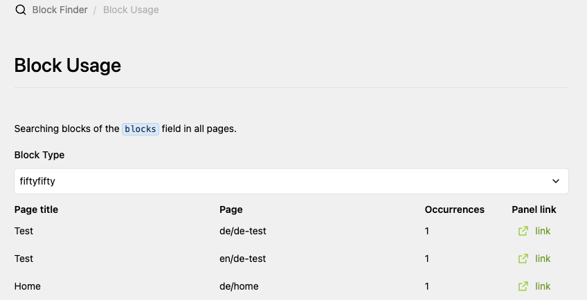

# Kirby Block Finder

A Kirby 5 Panel plugin that finds where a given custom block type is used across your site.

It adds a **Block Finder** entry to the Panel menu. Pick a block type and the
plugin scans every page (in every language if so) for that block in a configurable
blocks field, listing each page, the language, the number of occurrences, and a
direct link into the Panel.



## Motivation

Did you ever found yourself asking: How to find out if a block is used on my customers’ website, which is just accessible via FTP?

## Features

- Panel view listing all available block types from your blueprints of a provided blocks typed field
- Searches every page returned by `site()->index()`
- Multi-language aware — reports occurrences per language
- Shows occurrence count and a deep link to the page in the Panel
- Configurable _blocks typed field_ and _blocks field name for a page template_

### Limitations

- Does not support nested blocks. Currently, it expects that the block-containing field is living at the root of a pages fields.
- Did not test with a huge number of pages. A batching process would be more suited for that.

## Requirements

- Kirby 5.1+ (just tested with 5.1 probably works on previous versions too)

## Installation

### Download

Download and copy this repository to /site/plugins/kirby-block-finder.

### Composer

> composer require andrekelling/kirby-block-finder

## Usage

1. Open the Panel and choose **Block Finder** from the menu.
2. Select a block type from the dropdown.
3. The matching pages are listed with their language, occurrence count, and a
   link to open the page in the Panel.

## Options

Override options in `site/config/config.php`:

```php
return [
    'andrekelling.kirby-block-finder.blueprintName' => 'fields/builder',
    'andrekelling.kirby-block-finder.fieldName' => 'myBlocksField',
];
```

| Option          | Default          | Description                                   |
|-----------------|------------------|-----------------------------------------------|
| `blueprintName` | `fields/builder` | Name of the blocks type field blueprint file. |
| `fieldName`     | `blocks`         | Name of the blocks field to search on a page. |

## Development

The Panel view is built from `src/index.js` with [kirbyup](https://github.com/johannschopplich/kirbyup).

```bash
# watch and rebuild on change
npm run dev

# production build
npm run build
```

The build output is written to `index.js`, which is loaded by the plugin.

## License

MIT © André Kelling
